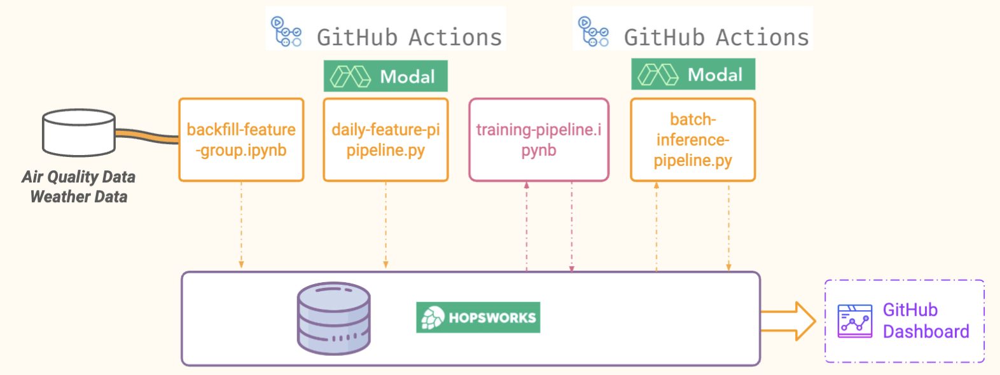

# air-quality-prediction-service



## Initialization

First, let's create the virtual environment:

```bash
>> conda env create -n AirQuality -f environment.yml
>> conda activate AirQuality
```

## Tasks
- [x] Create a free account on hopsworks.ai
- [x] Create a free account on github.com
- [ ] Build and run a feature pipeline on Github Actions
- [ ] Run a training pipeline
- [ ] Build and run a batch inference pipeline on Github Actions
- [ ] Visualize your air quality predictions with a dashboard

## References

[Assignment Instructions](./docs/instructions.pdf)

[Introduction Lecture](./docs/01-introduction.pdf)

[Serverless Machine Learning](./docs/02-serverless-ml.pdf)

[Building Machine Learning Systems with a Feature Store, Chapter 03](https://learning.oreilly.com/library/view/building-machine-learning/9781098165222/)

[Conda Virtual Environment Guide - Medium](https://medium.com/@viraj1604/comprehensive-guide-conda-virtual-environment-d70fafa7cf48)

[Viña del Mar - Air Quality Aqicn](https://aqicn.org/city/chile/vina-del-mar/)

[Viña del Mar - Air Quality OpenMeteo](https://open-meteo.com/en/docs/air-quality-api#latitude=-33.0246&longitude=-71.5518)